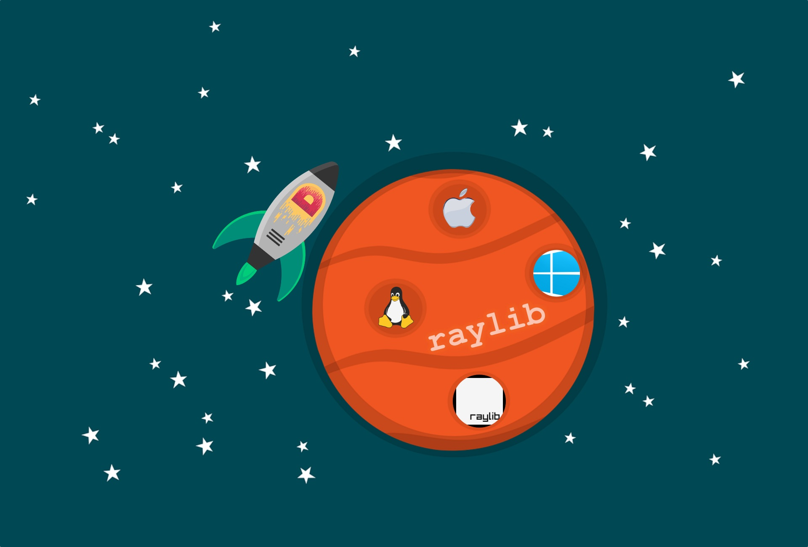

# D/Raylib project template
This is a D/Raylib project template. All you need is `dub.json` file; copy-paste it into your project.



## Requirements
* [D](https://dlang.org/download) compiler
* [DUB](https://dub.pm/) package manager
* [Raylib](https://github.com/raysan5/raylib/releases) library (you can use the precompiled binaries)

I highly recommend using the LDC compiler. It does the best optimizations. The DMD compiler, on the other hand, has the newest features.

### Install raylib using DUB
```
dub add raylib-d
dub fetch
dub run raylib-d:install
```

## Youtube video
Alternatively, watch my [video](https://www.youtube.com/watch?v=yIVHdaPTtcE) explaining how to set up D/Raylib on OSX, Linux and Windows.

## LICENSE
The license used is MIT.
